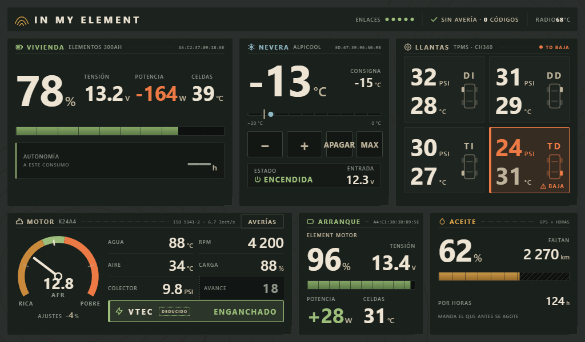
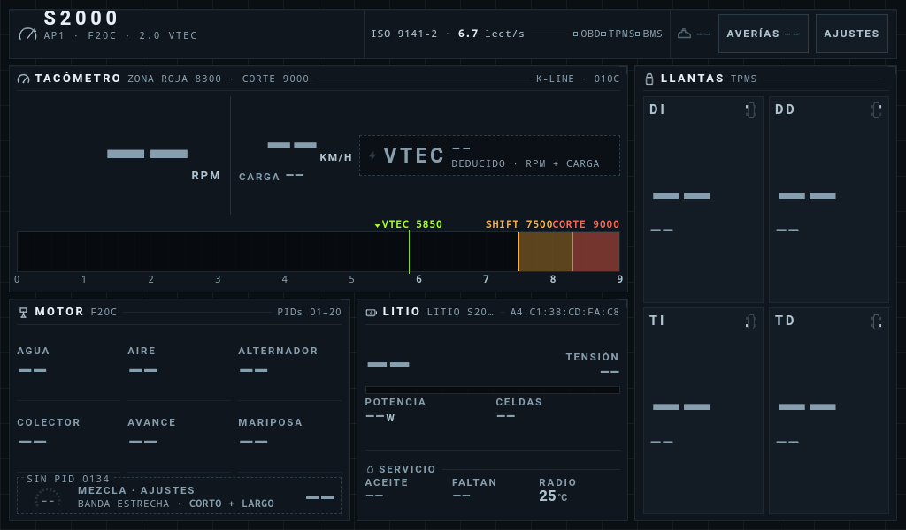
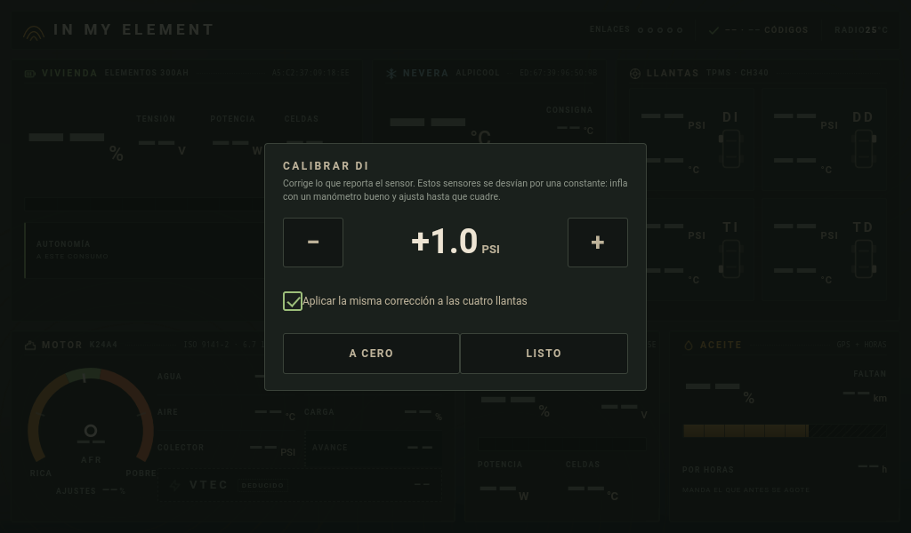
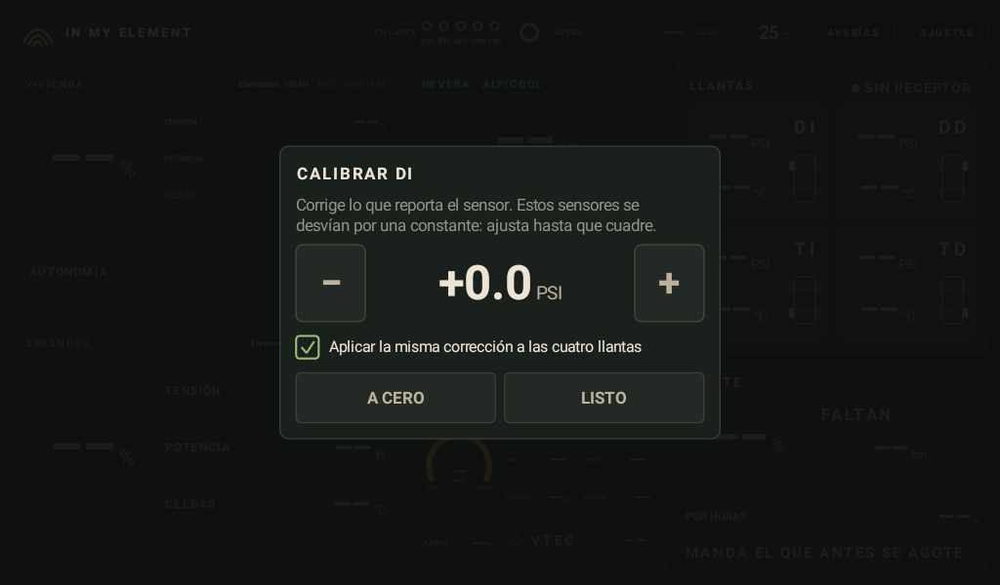
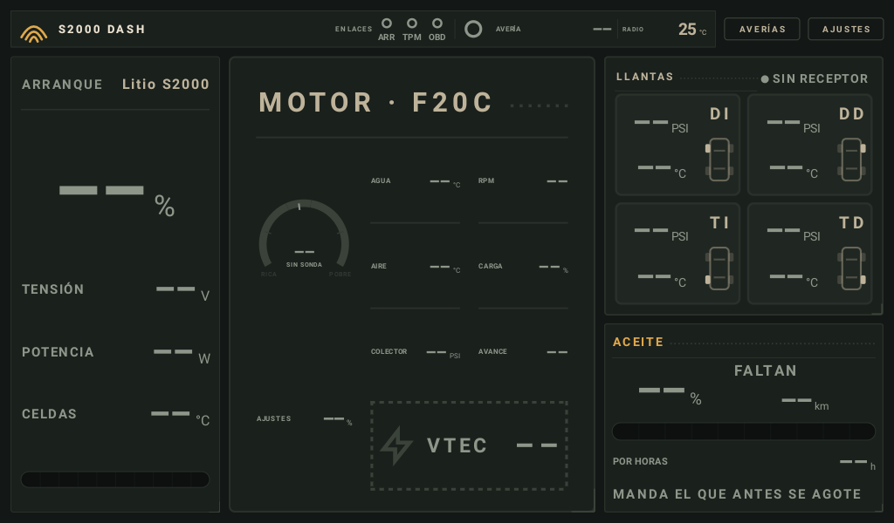
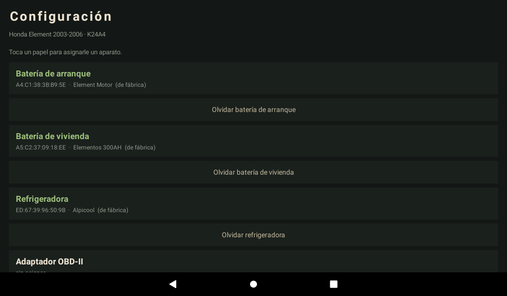
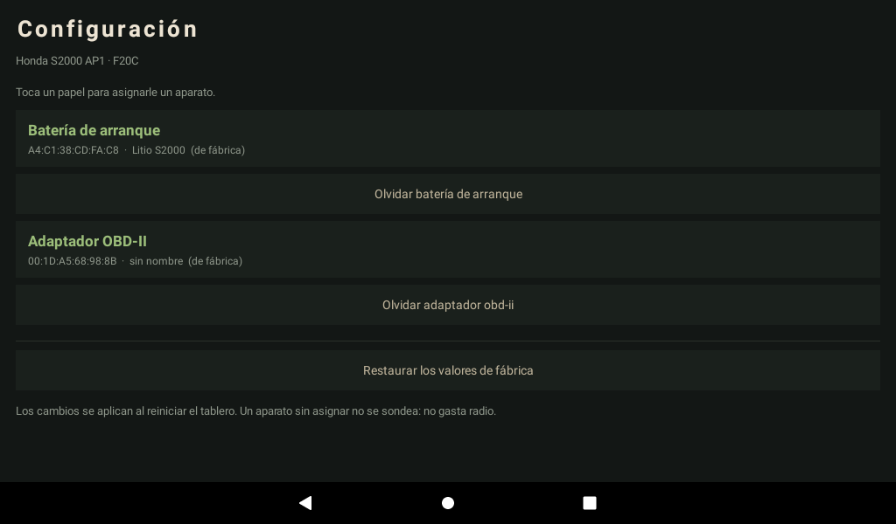

# carsoc — dos tableros para dos Honda

Dos aplicaciones Android que convierten el head unit de un carro en un
tablero en vivo: leen el motor por OBD-II, las baterías de litio por
Bluetooth, la presión de las llantas por un receptor USB y, en uno de los
dos, la refrigeradora de la casa rodante.

Son **hermanas, no forks**: un solo módulo con dos sabores que comparten el
95 % del código.

| | **In my element** | **S2000 Dash** |
|---|---|---|
| Carro | Honda Element 2003-2006 | Honda S2000 AP1 |
| Motor | K24A4 | F20C |
| Qué es | casa rodante overland | roadster |
| Pantalla | 1024×600 | 1280×480 |
| Manda | el litio y la nevera | el motor |
| Paquete | `com.nonosky.inmyelement` | `com.nonosky.s2000dash` |



*In my element, con datos en todas las secciones. Lo que no se ha medido
sale como `--`, nunca como cero.*

## Por qué existe

Los tableros de fábrica de estos carros no dicen casi nada, y las apps de
OBD-II genéricas están hechas para diagnosticar parado, no para mirarse de
reojo a 120 km/h. Estas dos están hechas para **leerse de un vistazo
mientras manejas**, y para no mentir nunca.

## La regla que ordena todo el proyecto

> **Un valor que no se ha medido no se pinta.**

Suena obvio y es lo más difícil de sostener. Un dato ausente o rancio sale
como `--` y apagado, **jamás como cero** — porque un 0 y un «no lo sé»
significan cosas opuestas. Lo que se deduce en vez de medirse va marcado
como deducido. Y lo que el carro no puede dar, no se dibuja.

El historial del repositorio está lleno de veces que esta regla se rompió y
hubo que arreglarla. Algunas de verdad caras:

- La fila de mezcla llegó a pintar **«+3 %» en verde** sumando un ajuste de
  combustible que faltaba. Un motor con el ajuste largo en +22 % —fuga de
  vacío, la centralita al límite— se veía sano.
- La tarjeta de batería mostraba **la de arranque bajo el rótulo de la de
  vivienda**, porque el vigilante barría y se quedaba con el primer BMS que
  veía. Con dos bancos iguales, cuál te toca es cuestión de suerte.
- El tablero decía **«Motor parado»** cuando lo que pasaba es que no había
  enlace con la ECU. Con el motor andando, eso te hace creer que el cargador
  no carga.
- El aviso de **llanta baja estaba pintado a mano** en el HTML: gritaba una
  pinchada con las cuatro presiones sin dato.

## Qué lee cada una

**Motor** — OBD-II por ISO 9141-2 (K-line) sobre un ELM327 por Bluetooth.
Reparto de turnos explícito: con K-line hay ~9 lecturas por segundo para
repartir entre todo, y el RPM se lleva su parte por contrato, con una prueba
que lo vigila.

**Baterías de litio** — BMS JBD por BLE, cada banco fijado por su MAC desde
el menú de emparejamiento. Nunca por barrido, que es como se cruzaron.

**Llantas** — receptor TPMS por USB (CH340), con detección de pinchazo:
perder 3 PSI en 2 minutos dispara una alerta a pantalla completa con sonido
de **alarma**, no de notificación — con música puesta, un «ding» se pierde.

**Refrigeradora** (solo el Element) — Alpicool por BLE, con control de
encendido, modo y consigna. El protocolo está implementado desde cero con
diez pruebas que decodifican capturas reales.

**Averías** — modos 03, 07 y 0A, con una tabla de códigos **filtrada contra
el motor concreto**: 102 para el K24A4, 81 para el F20C. Nada de códigos que
ese carro no puede dar.

## Los dos tableros

| **In my element** — topográfico | **S2000 Dash** — cyberpunk |
|---|---|
|  |  |

Hermanos, no gemelos. Uno es una casa rodante donde manda el litio; el otro
un roadster que gira a 9 000 y donde el VTEC **sí** es un acontecimiento.

Fíjate en el S2000: su reloj de mezcla está **apagado**, con la leyenda `SIN
PID 0134 · BANDA ESTRECHA`. Ese carro no puede medir la mezcla, y el tablero
lo dice en vez de inventarse un número.

## Calibrar las llantas



| HTML | Canvas |
|---|---|
|  |  |

Los sensores TPMS baratos se desvían por una constante. Se corrigen
**sosteniendo el dedo** sobre una rueda —sostenido, no un toque: a media
curva se toca cualquier cosa—, y por omisión la corrección se aplica a las
cuatro. Está en las **dos variantes y los dos carros**, con el mismo gesto y
guardando en el mismo sitio: una rueda calibrada desde el tablero HTML sale
ya corregida en el de Canvas.

La corrección se aplica **en la capa de datos, no al pintar**. Si solo
corrigiera lo dibujado, una rueda calibrada a −3 PSI daría la alarma tres
libras antes de tiempo todos los días, hasta que aprendieras a ignorarla.

## Las dos variantes de tablero



*El S2000 pintado en Canvas nativo.* Se elige en ajustes.

Y aquí hay una cifra en vez de una promesa, porque por fin se midió — con el
carro parado, en el emulador, **no en el radio**:

| | hilos | PSS | CPU en 30 s |
|---|---|---|---|
| HTML sobre WebView | 56 | 83,6 MB | 0,5 % de un núcleo |
| Canvas nativo | 33 | **29,4 MB** | **0,2 %** de un núcleo |

La primera medición dejó al Canvas en **3,4 %** — siete veces peor que el
WebView, justo al revés de lo que este proyecto llevaba meses afirmando.
Repintaba la pantalla entera cinco veces por segundo pasara lo que pasara,
mientras el WebView solo recompone cuando algo cambia. Ahora repinta cuando
hay motivo: los datos cambiaron, o algo está parpadeando.

Además el Canvas **deja que el guardián térmico gobierne los fotogramas**:
baja a uno por segundo cuando el radio se calienta. La de HTML no hace eso.

## El menú de emparejamiento

Cada aparato se asigna a mano a su papel. Nunca por barrido — así es
justamente como se cruzaron las dos baterías.

| In my element | S2000 Dash |
|---|---|
|  |  |

El menú **solo ofrece lo que ese carro lleva**: el S2000 no tiene banco de
vivienda ni refrigeradora, y no aparecen. Y un valor de fábrica se muestra
marcado como tal, porque uno que parece elegido hace creer que alguien lo
comprobó.

## Cómo está hecho

- **Kotlin**, sin frameworks de UI. Vistas y dibujo en código.
- **Dos variantes de tablero**: una en HTML dentro de un WebView y otra en
  **Canvas nativo**. La de Canvas es más ligera y deja que el guardián
  térmico gobierne los fotogramas; la de HTML se itera y se prueba fuera del
  carro. Se eligen con un interruptor.
- **Un puente HTTP** en el puerto 8099 para controlar y depurar el radio
  entero desde una laptop, sin tocar la pantalla.
- **Auto-actualización** por descubrimiento UDP, con verificación de firma
  del APK antes de instalar.

## Probar sin carro

Hay dos emuladores, uno por radio: `elementradio` a 1024×600 y `s2000radio`
a 1280×480. Probar en la resolución equivocada no vale — es exactamente así
como se descubrió que el tablero del S2000 se rompía.

```bash
powershell -ExecutionPolicy Bypass -File tools/e2e.ps1
```

Compila los dos sabores, los instala y recorre **las dos variantes de cada
uno** —cuatro tableros—, navega sus pantallas, calibra una llanta y deja las
capturas en `build/e2e/`. Una prueba de interfaz que solo dice «pasó» y no
enseña nada no vale de mucho.

Toca los botones de verdad en vez de lanzar las pantallas por intent, y eso
ya se ha pagado dos veces: así se descubrió que el tablero del S2000 se había
quedado **sin botón de ajustes** —con el menú de emparejamiento inalcanzable
en ese carro— y que el Canvas del S2000 tachaba cinco celdas del motor por no
caber.

> Si el emulador nunca arranca, casi seguro es el diálogo de consentimiento
> que aparece tras una caída previa y **bloquea el arranque esperando un
> clic**. Por eso el script pasa `-no-metrics`.

## Construir

```bash
gradle :app:assembleElementRelease
gradle :app:assembleS2000Release
```

Salen dos APK independientes que pueden convivir en el mismo aparato.

```bash
gradle :app:testElementReleaseUnitTest
gradle :app:testS2000ReleaseUnitTest
```

Las pruebas que afirman cifras de un motor viven con su sabor: una prueba
que dice «el VTEC engancha a 2 200» habla del K24A4, no del código. En el
común solo van las que valen para los dos carros.

## Documentación

Las bitácoras de `docs/` no son documentación de API: son **el registro de
lo que costó horas averiguar y no se deduce leyendo el código**. Qué
hipótesis se descartaron y con qué evidencia, qué trampas mordieron, y qué
sigue sin verificarse.

Si vas a tocar algo, empieza por ahí.

## Estado

Honesto: **el Element está corriendo en el carro** leyendo baterías, nevera
y llantas. El motor sigue sin ejercitarse ni una vez en ese vehículo — falta
el adaptador. El S2000 está construido y probado, pendiente de volver a su
radio.

## Licencia

MIT. Ver [LICENSE](LICENSE).
